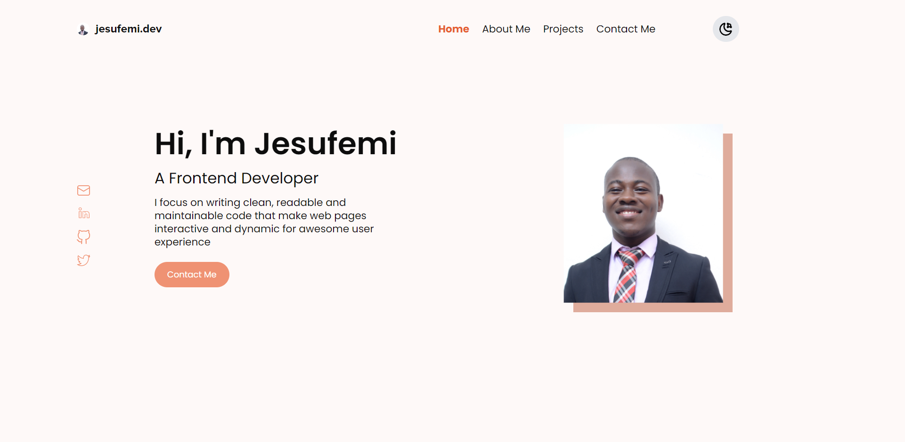

# My Portfolio Website

This is my portfolio website that contains various projects I have worked on,my contact details and resume 

## Table of contents

- [Overview](#overview)
  - [Links](#links)
- [My process](#my-process)
  - [Built with](#built-with)
- [Author](#author)

## Overview

### Screenshot

### Links

- Live Site URL: [Live](jesufemi.dev)

## My process

### Built with

- Semantic HTML5 markup
- CSS custom properties
- Flexbox
- CSS Grid
- Mobile-first workflow
- [React](https://reactjs.org/) - JS library
- [Styled Components](https://styled-components.com/) - For styles

## Author

- Website - [Jesufemi Oladapo](jesufemi.dev)
- LinkedIn - [Jesufemi Oladapo](https://www.linkedin.com/in/jesufemi-oladapo-9bb9ba175/)
- Twitter - [@jesufemigan](https://www.twitter.com/jesufemigan)
